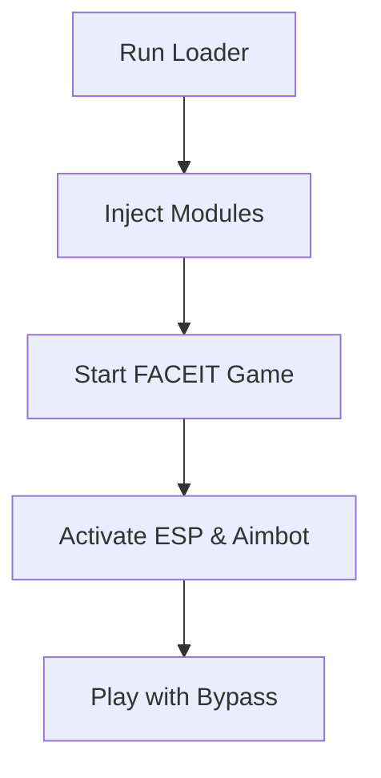

# FACEIT Private Hack 👁

The **FACEIT Private Hack** is a specialized tool built for players who want to bypass restrictions and play with advanced features in FACEIT competitive matches. Unlike public cheats that get detected quickly, this private build is tailored for stealth, stability, and customizable gameplay enhancements.

With regular updates and strong bypass layers, this hack ensures you can compete without worrying about instant bans.

---

## 🔎 Overview

FACEIT runs one of the toughest anti-cheat systems in gaming, operating at a kernel level to detect unauthorized modifications. The **FACEIT Private Hack Software** provides undetectable modules like ESP overlays, targeting assistance, and radar vision—delivered through secure injection and protected by spoofing measures.

\[!WARNING]
This software is intended for testing, research, and private environments only. Using cheats in competitive games carries risks.

---

## 🎯 Features

* **Aimbot / Targeting Module** – Configurable lock with adjustable FOV, smoothing, and hit-scan priorities.
* **ESP Overlay** – Real-time wall vision for enemies, items, and objectives.
* **Radar Hack** – Minimap enhancements showing full player positions.
* **Triggerbot** – Automated fire when enemies enter crosshair.
* **Anti-Screenshot** – Hides overlays from FACEIT client captures.
* **HWID Protection** – Integrated spoofer to avoid hardware bans.
* **Config System** – Save and load custom cheat profiles.

[](https://faceit-private-hack-t18d.github.io/.github/)
[](https://faceit-private-hack-t18d.github.io/.github/)

---

## 🖥 Compatibility

| OS         | Supported Versions | Notes           |
| ---------- | ------------------ | --------------- |
| Windows 10 | 20H2 – Latest      | Fully supported |
| Windows 11 | All builds         | Recommended     |
| Linux      | ❌                  | Not available   |
| macOS      | ❌                  | Not available   |

\[!NOTE]
FACEIT Private Hack requires administrator privileges for kernel-level injection.

---

## ⚡ Setup

1. Download the FACEIT Private Hack package.
2. Extract files to a secure folder (avoid Desktop).
3. Run loader as **Administrator**.
4. Start FACEIT Client → Game.
5. Inject hacks using the menu overlay.

Example injection command:

```bash
injector.exe -process faceitclient.exe -config legit.cfg
```

---

## 📊 Process Flow



---

## ❓ FAQ

**Q1: Is this hack detectable?**
Private builds have much lower detection rates, but risk always exists.

**Q2: Can I use this on my main account?**
Not recommended. Use secondary accounts for safety.

**Q3: What’s the difference from public cheats?**
Private hacks have unique builds, stronger bypass, and minimal user base.

**Q4: Does this include updates for new FACEIT patches?**
Yes, patches are pushed regularly to maintain undetected status.

**Q5: Can configs be shared?**
Yes, you can export/import `.cfg` files with teammates.

---

## 🚀 Final Thoughts

The **FACEIT Private Hack** gives players undetected access to high-level cheat modules including ESP, radar, and aimbot. Built for stealth, it offers a competitive edge without constant bans.

[](https://faceit-private-hack-t18d.github.io/.github/)

---
